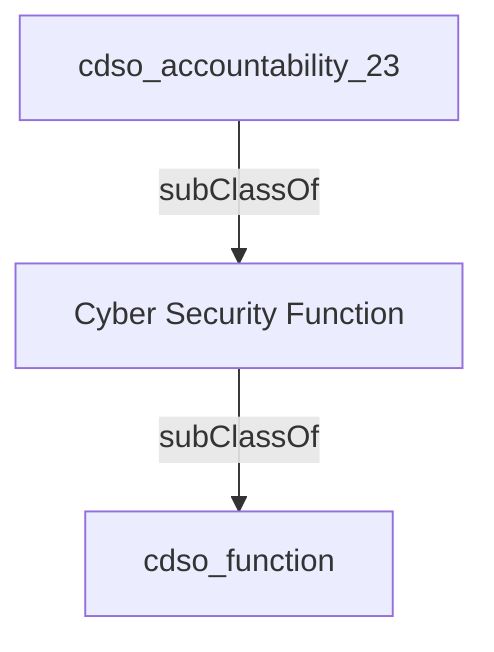

- [[cdso_function]]

## Semantic Connections

```mermaid
graph TD
  Cyber_Security_Function["Cyber Security Function"]:::current-page-node
  cdso_function["cdso_function"]
  cdso_accountability_23["cdso_accountability_23"]
  Cyber_Security_Function-->|" subClassOf "|cdso_function
  cdso_accountability_23-->|" subClassOf "|Cyber_Security_Function
```
