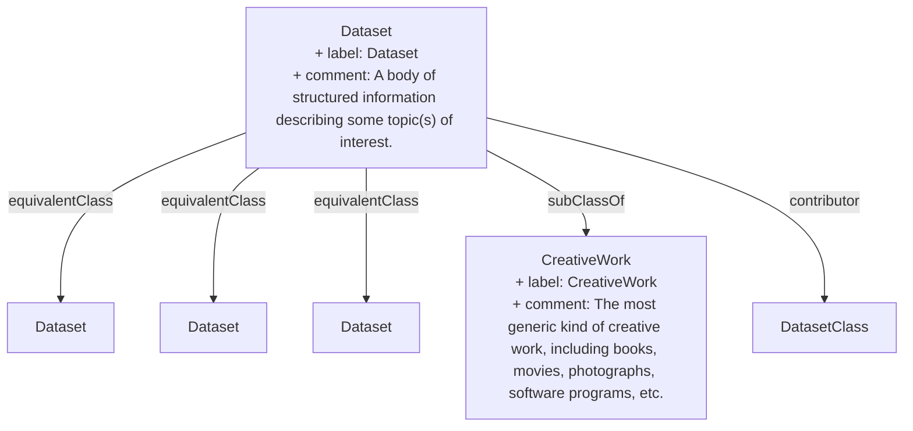

> A body of structured information describing some topic(s) of interest.[^1]

[^1]: [Dataset - Schema.org Type](https://schema.org/Dataset)- [[CreativeWork]]- [[CreativeWork]]- [[CreativeWork]]- [[CreativeWork]]

## Related Links

- [[CreativeWork]]

## Semantic Connections

