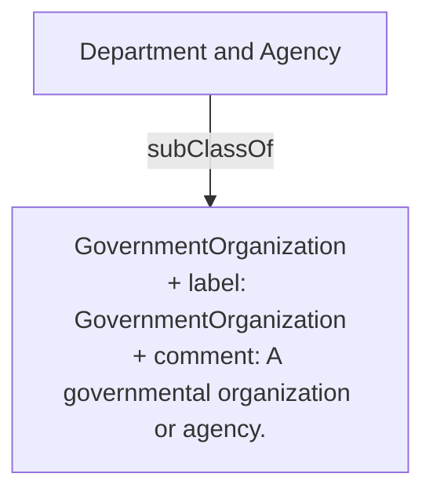

## Related Links

- [[GovernmentOrganization]]

## Semantic Connections

```mermaid
graph TD
  Department_and_Agency["Department and Agency"]:::current-page-node
  GovernmentOrganization["GovernmentOrganization<br>+ label: GovernmentOrganization<br>+ comment: A governmental organization or agency."]
  Department_and_Agency-->|" subClassOf "|GovernmentOrganization
```
