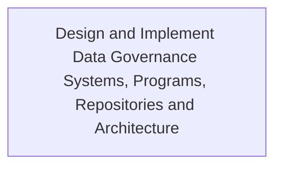

[[data_governance_systems]]
[[data_programs]]
[[data_repositories]]
[[data_architecture]]

## Semantic Connections

```mermaid
graph TD
  Design_and_Implement_Data_Governance_Systems_Programs_Repositories_and_Architecture["Design and Implement Data Governance Systems, Programs, Repositories and Architecture"]:::current-page-node
```
