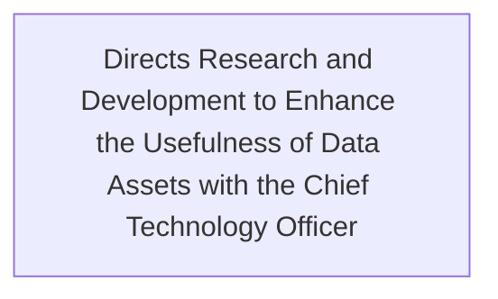

In collaboration with the [[Chief Technology Officer]], directs research and development to enhance the usefulness of data assets including the application of artificial intelligence

## Semantic Connections

