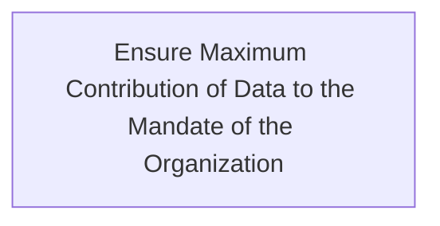

## Semantic Connections

```mermaid
graph TD
  Ensure_Maximum_Contribution_of_Data_to_the_Mandate_of_the_Organization["Ensure Maximum Contribution of Data to the Mandate of the Organization"]:::current-page-node
```
