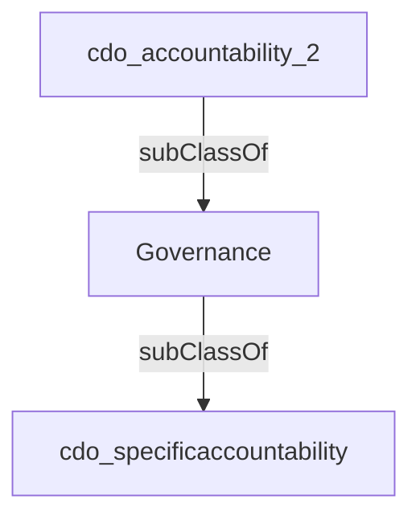

## Related Links

- [[cdo_accountability_2]]
- [[cdo_specificaccountability]]

## Semantic Connections

```mermaid
graph TD
  Governance["Governance"]:::current-page-node
  cdo_specificaccountability["cdo_specificaccountability"]
  cdo_accountability_2["cdo_accountability_2"]
  cdo_accountability_2-->|" subClassOf "|Governance
  Governance-->|" subClassOf "|cdo_specificaccountability
```
