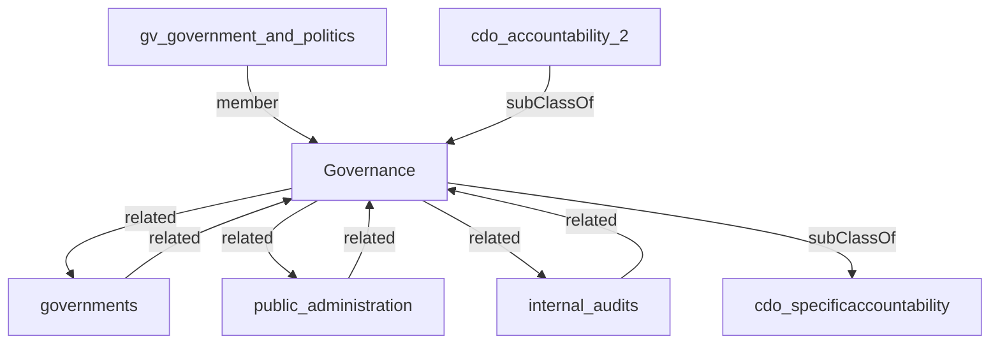

- [[gv_government_and_politics]]

## Semantic Connections

```mermaid
graph TD
  Governance["Governance"]:::current-page-node
  governments["governments"]
  internal_audits["internal_audits"]
  public_administration["public_administration"]
  cdo_specificaccountability["cdo_specificaccountability"]
  gv_government_and_politics["gv_government_and_politics"]
  cdo_accountability_2["cdo_accountability_2"]
  Governance-->|" related "|governments
  gv_government_and_politics-->|" member "|Governance
  governments-->|" related "|Governance
  internal_audits-->|" related "|Governance
  Governance-->|" related "|public_administration
  Governance-->|" related "|internal_audits
  cdo_accountability_2-->|" subClassOf "|Governance
  public_administration-->|" related "|Governance
  Governance-->|" subClassOf "|cdo_specificaccountability
```
