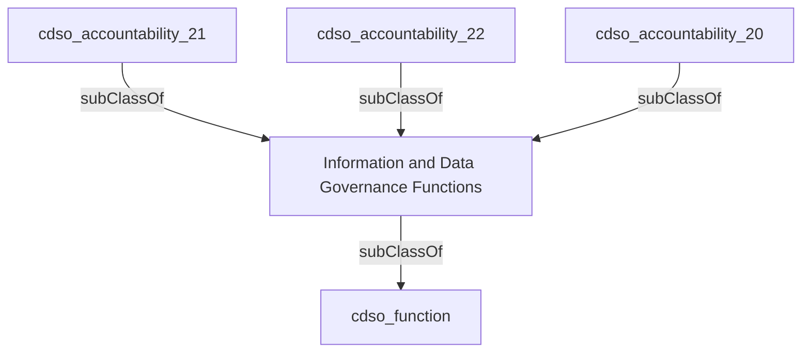

- [[cdso_function]]

## Semantic Connections

```mermaid
graph TD
  Information_and_Data_Governance_Functions["Information and Data Governance Functions"]:::current-page-node
  cdso_function["cdso_function"]
  cdso_accountability_20["cdso_accountability_20"]
  cdso_accountability_21["cdso_accountability_21"]
  cdso_accountability_22["cdso_accountability_22"]
  Information_and_Data_Governance_Functions-->|" subClassOf "|cdso_function
  cdso_accountability_21-->|" subClassOf "|Information_and_Data_Governance_Functions
  cdso_accountability_22-->|" subClassOf "|Information_and_Data_Governance_Functions
  cdso_accountability_20-->|" subClassOf "|Information_and_Data_Governance_Functions
```
