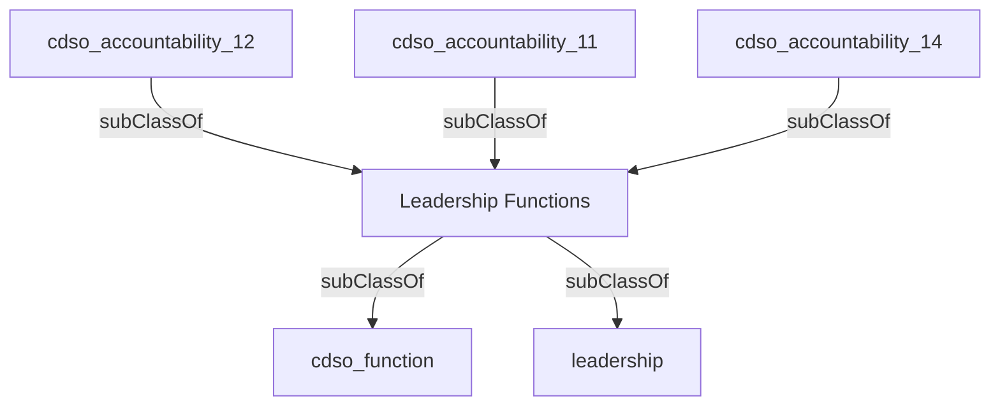

- [[leadership]]

## Semantic Connections

```mermaid
graph TD
  Leadership_Functions["Leadership Functions"]:::current-page-node
  cdso_function["cdso_function"]
  leadership["leadership"]
  cdso_accountability_11["cdso_accountability_11"]
  cdso_accountability_12["cdso_accountability_12"]
  cdso_accountability_14["cdso_accountability_14"]
  cdso_accountability_12-->|" subClassOf "|Leadership_Functions
  Leadership_Functions-->|" subClassOf "|cdso_function
  cdso_accountability_11-->|" subClassOf "|Leadership_Functions
  cdso_accountability_14-->|" subClassOf "|Leadership_Functions
  Leadership_Functions-->|" subClassOf "|leadership
```
