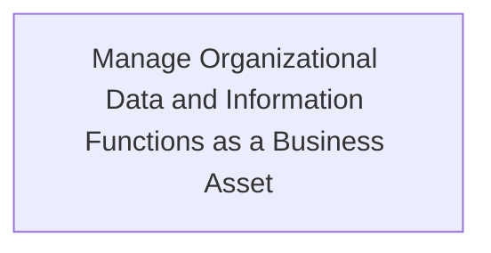

## Semantic Connections

```mermaid
graph TD
  Manage_Organizational_Data_and_Information_Functions_as_a_Business_Asset["Manage Organizational Data and Information Functions as a Business Asset"]:::current-page-node
```
