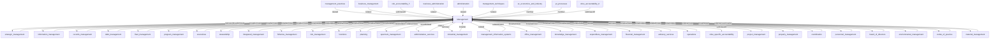

- [[pr_processes]]

## Semantic Connections

```mermaid
graph TD
  Management["Management"]:::current-page-node
  debt_management["debt_management"]
  environmental_management["environmental_management"]
  expenditure_management["expenditure_management"]
  financial_management["financial_management"]
  fisheries_management["fisheries_management"]
  fleet_management["fleet_management"]
  industrial_management["industrial_management"]
  information_management["information_management"]
  integrated_management["integrated_management"]
  knowledge_management["knowledge_management"]
  material_management["material_management"]
  office_management["office_management"]
  personnel_management["personnel_management"]
  program_management["program_management"]
  project_management["project_management"]
  property_management["property_management"]
  records_management["records_management"]
  risk_management["risk_management"]
  spectrum_management["spectrum_management"]
  strategic_management["strategic_management"]
  administrative_services["administrative_services"]
  advisory_services["advisory_services"]
  board_of_directors["board_of_directors"]
  codes_of_practice["codes_of_practice"]
  coordination["coordination"]
  executives["executives"]
  functions["functions"]
  management_information_systems["management_information_systems"]
  operations["operations"]
  planning["planning"]
  stewardship["stewardship"]
  cdso_specific_accountability["cdso_specific_accountability"]
  ec_economics_and_industry["ec_economics_and_industry"]
  pr_processes["pr_processes"]
  business_administration["business_administration"]
  business_management["business_management"]
  administration["administration"]
  management_practices["management_practices"]
  management_techniques["management_techniques"]
  cdso_accountability_8["cdso_accountability_8"]
  cdo_accountability_5["cdo_accountability_5"]
  management_practices-->|" related "|Management
  property_management-->|" broader "|Management
  Management-->|" narrower "|strategic_management
  Management-->|" narrower "|information_management
  fisheries_management-->|" broader "|Management
  Management-->|" narrower "|records_management
  program_management-->|" broader "|Management
  Management-->|" narrower "|debt_management
  Management-->|" narrower "|fleet_management
  Management-->|" narrower "|program_management
  board_of_directors-->|" related "|Management
  planning-->|" related "|Management
  stewardship-->|" related "|Management
  Management-->|" related "|executives
  integrated_management-->|" broader "|Management
  information_management-->|" broader "|Management
  Management-->|" related "|stewardship
  Management-->|" narrower "|integrated_management
  business_management-->|" related "|Management
  industrial_management-->|" broader "|Management
  Management-->|" narrower "|fisheries_management
  expenditure_management-->|" broader "|Management
  cdo_accountability_5-->|" subClassOf "|Management
  administrative_services-->|" related "|Management
  functions-->|" related "|Management
  risk_management-->|" broader "|Management
  Management-->|" narrower "|risk_management
  Management-->|" related "|functions
  Management-->|" related "|planning
  Management-->|" narrower "|spectrum_management
  Management-->|" related "|administrative_services
  business_administration-->|" related "|Management
  administration-->|" related "|Management
  management_techniques-->|" related "|Management
  Management-->|" narrower "|industrial_management
  office_management-->|" broader "|Management
  Management-->|" related "|management_information_systems
  knowledge_management-->|" broader "|Management
  financial_management-->|" broader "|Management
  Management-->|" narrower "|office_management
  strategic_management-->|" broader "|Management
  Management-->|" narrower "|knowledge_management
  Management-->|" narrower "|expenditure_management
  Management-->|" narrower "|financial_management
  Management-->|" related "|advisory_services
  Management-->|" related "|operations
  project_management-->|" broader "|Management
  operations-->|" related "|Management
  management_information_systems-->|" related "|Management
  Management-->|" subClassOf "|cdso_specific_accountability
  Management-->|" narrower "|project_management
  Management-->|" narrower "|property_management
  ec_economics_and_industry-->|" member "|Management
  debt_management-->|" broader "|Management
  material_management-->|" broader "|Management
  executives-->|" related "|Management
  pr_processes-->|" member "|Management
  cdso_accountability_8-->|" subClassOf "|Management
  codes_of_practice-->|" related "|Management
  Management-->|" related "|coordination
  records_management-->|" broader "|Management
  Management-->|" narrower "|personnel_management
  personnel_management-->|" broader "|Management
  Management-->|" related "|board_of_directors
  Management-->|" narrower "|environmental_management
  coordination-->|" related "|Management
  environmental_management-->|" broader "|Management
  Management-->|" related "|codes_of_practice
  spectrum_management-->|" broader "|Management
  fleet_management-->|" broader "|Management
  advisory_services-->|" related "|Management
  Management-->|" narrower "|material_management
```
