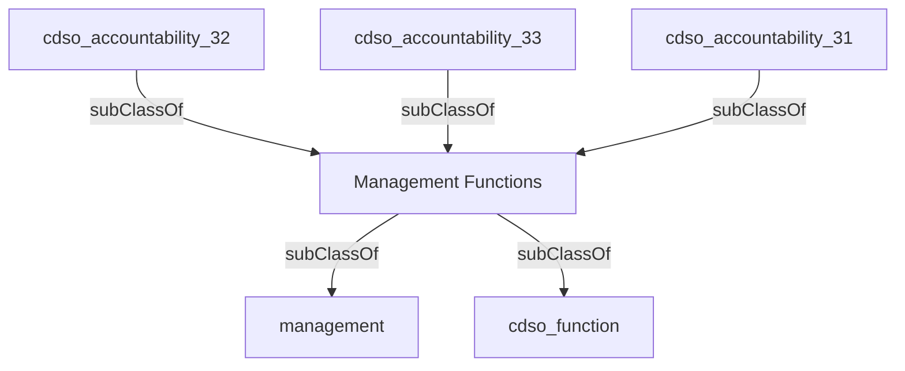

## Related Links

- [[cdso_accountability_31]]
- [[cdso_accountability_32]]
- [[cdso_accountability_33]]
- [[cdso_function]]
- [[management]]

## Semantic Connections

```mermaid
graph TD
  Management_Functions["Management Functions"]:::current-page-node
  cdso_function["cdso_function"]
  management["management"]
  cdso_accountability_31["cdso_accountability_31"]
  cdso_accountability_32["cdso_accountability_32"]
  cdso_accountability_33["cdso_accountability_33"]
  cdso_accountability_32-->|" subClassOf "|Management_Functions
  Management_Functions-->|" subClassOf "|management
  Management_Functions-->|" subClassOf "|cdso_function
  cdso_accountability_33-->|" subClassOf "|Management_Functions
  cdso_accountability_31-->|" subClassOf "|Management_Functions
```
