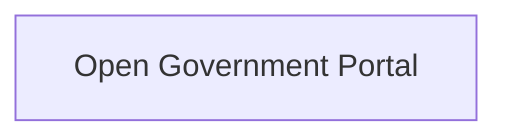

> A repository to access resources and data sets published by government institutions.[^1]

[^1]: [Open Government Portal](https://search.open.canada.ca/opendata/)

## Semantic Connections

```mermaid
graph TD
  Open_Government_Portal["Open Government Portal"]:::current-page-node
```
