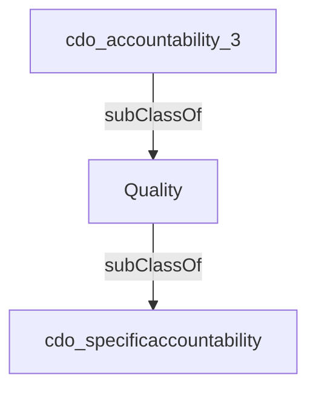

- [[cdo_specificaccountability]]

## Semantic Connections

```mermaid
graph TD
  Quality["Quality"]:::current-page-node
  cdo_specificaccountability["cdo_specificaccountability"]
  cdo_accountability_3["cdo_accountability_3"]
  cdo_accountability_3-->|" subClassOf "|Quality
  Quality-->|" subClassOf "|cdo_specificaccountability
```
