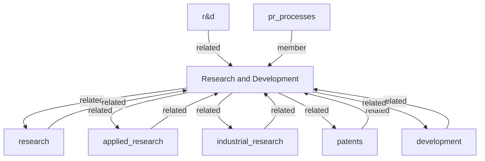

- [[pr_processes]]

## Semantic Connections

```mermaid
graph TD
  Research_and_Development["Research and Development"]:::current-page-node
  applied_research["applied_research"]
  development["development"]
  industrial_research["industrial_research"]
  patents["patents"]
  research["research"]
  pr_processes["pr_processes"]
  rd["r&d"]
  industrial_research-->|" related "|Research_and_Development
  development-->|" related "|Research_and_Development
  rd-->|" related "|Research_and_Development
  Research_and_Development-->|" related "|research
  research-->|" related "|Research_and_Development
  Research_and_Development-->|" related "|applied_research
  Research_and_Development-->|" related "|industrial_research
  Research_and_Development-->|" related "|patents
  pr_processes-->|" member "|Research_and_Development
  patents-->|" related "|Research_and_Development
  Research_and_Development-->|" related "|development
  applied_research-->|" related "|Research_and_Development
```
