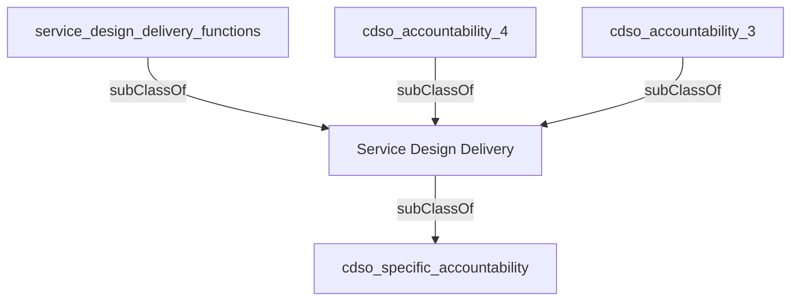

## Related Links

- [[cdso_accountability_3]]
- [[cdso_accountability_4]]
- [[cdso_specific_accountability]]
- [[service_design_delivery_functions]]

## Semantic Connections

```mermaid
graph TD
  Service_Design_Delivery["Service Design Delivery"]:::current-page-node
  cdso_specific_accountability["cdso_specific_accountability"]
  cdso_accountability_3["cdso_accountability_3"]
  cdso_accountability_4["cdso_accountability_4"]
  service_design_delivery_functions["service_design_delivery_functions"]
  service_design_delivery_functions-->|" subClassOf "|Service_Design_Delivery
  Service_Design_Delivery-->|" subClassOf "|cdso_specific_accountability
  cdso_accountability_4-->|" subClassOf "|Service_Design_Delivery
  cdso_accountability_3-->|" subClassOf "|Service_Design_Delivery
```
