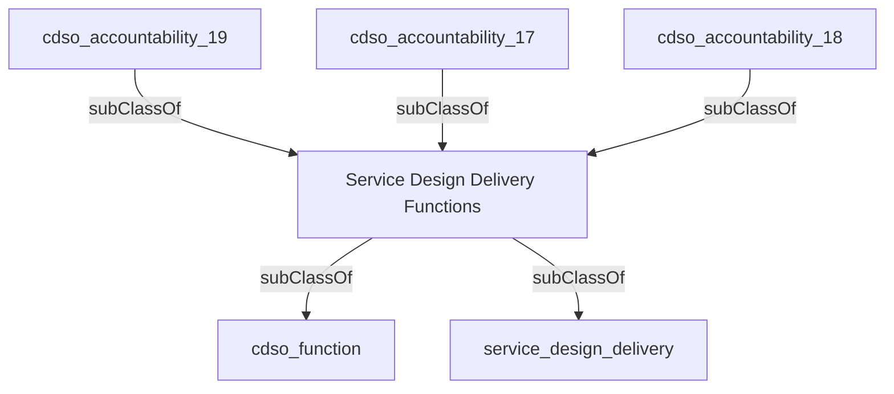

- [[service_design_delivery]]

## Semantic Connections

```mermaid
graph TD
  Service_Design_Delivery_Functions["Service Design Delivery Functions"]:::current-page-node
  cdso_function["cdso_function"]
  service_design_delivery["service_design_delivery"]
  cdso_accountability_17["cdso_accountability_17"]
  cdso_accountability_18["cdso_accountability_18"]
  cdso_accountability_19["cdso_accountability_19"]
  Service_Design_Delivery_Functions-->|" subClassOf "|cdso_function
  Service_Design_Delivery_Functions-->|" subClassOf "|service_design_delivery
  cdso_accountability_19-->|" subClassOf "|Service_Design_Delivery_Functions
  cdso_accountability_17-->|" subClassOf "|Service_Design_Delivery_Functions
  cdso_accountability_18-->|" subClassOf "|Service_Design_Delivery_Functions
```
