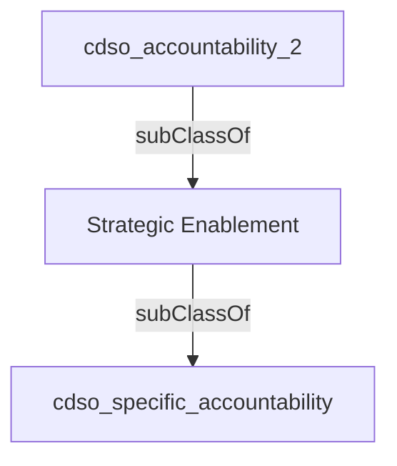

- [[cdso_specific_accountability]]

## Semantic Connections

```mermaid
graph TD
  Strategic_Enablement["Strategic Enablement"]:::current-page-node
  cdso_specific_accountability["cdso_specific_accountability"]
  cdso_accountability_2["cdso_accountability_2"]
  Strategic_Enablement-->|" subClassOf "|cdso_specific_accountability
  cdso_accountability_2-->|" subClassOf "|Strategic_Enablement
```
