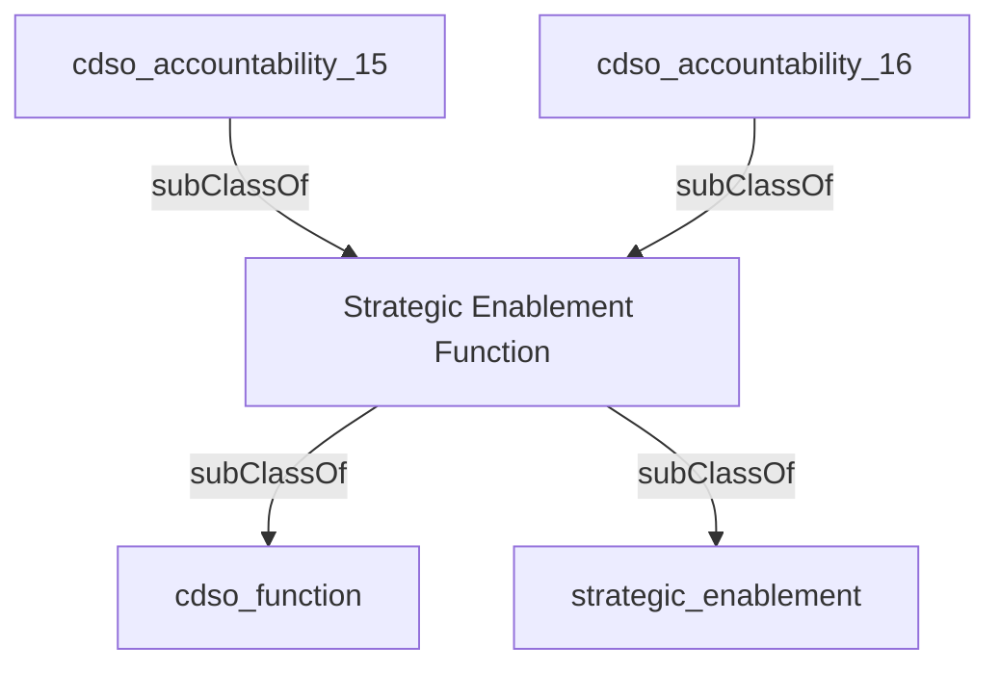

- [[strategic_enablement]]

## Semantic Connections

```mermaid
graph TD
  Strategic_Enablement_Function["Strategic Enablement Function"]:::current-page-node
  cdso_function["cdso_function"]
  strategic_enablement["strategic_enablement"]
  cdso_accountability_15["cdso_accountability_15"]
  cdso_accountability_16["cdso_accountability_16"]
  cdso_accountability_15-->|" subClassOf "|Strategic_Enablement_Function
  cdso_accountability_16-->|" subClassOf "|Strategic_Enablement_Function
  Strategic_Enablement_Function-->|" subClassOf "|cdso_function
  Strategic_Enablement_Function-->|" subClassOf "|strategic_enablement
```
