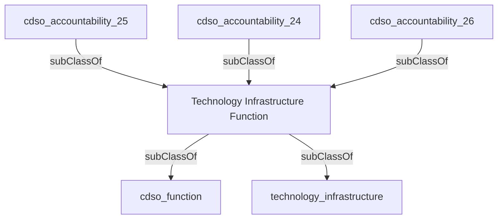

- [[technology_infrastructure]]

## Semantic Connections

```mermaid
graph TD
  Technology_Infrastructure_Function["Technology Infrastructure Function"]:::current-page-node
  cdso_function["cdso_function"]
  technology_infrastructure["technology_infrastructure"]
  cdso_accountability_24["cdso_accountability_24"]
  cdso_accountability_25["cdso_accountability_25"]
  cdso_accountability_26["cdso_accountability_26"]
  Technology_Infrastructure_Function-->|" subClassOf "|cdso_function
  cdso_accountability_25-->|" subClassOf "|Technology_Infrastructure_Function
  Technology_Infrastructure_Function-->|" subClassOf "|technology_infrastructure
  cdso_accountability_24-->|" subClassOf "|Technology_Infrastructure_Function
  cdso_accountability_26-->|" subClassOf "|Technology_Infrastructure_Function
```
