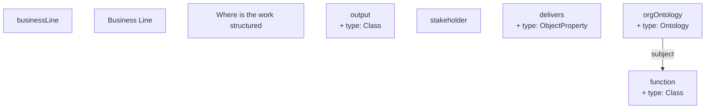

# BusinessLine

---

### Semantic Connections

```mermaid
graph TD
  businessLine["businessLine"]
  function["function<br>+ type: Class"]
  Business_Line["Business Line"]
  Where_is_the_work_structured["Where is the work structured"]
  output["output<br>+ type: Class"]
  stakeholder["stakeholder"]
  delivers["delivers<br>+ type: ObjectProperty"]
  orgOntology["orgOntology<br>+ type: Ontology"]
  orgOntology-->|" subject "|function
```