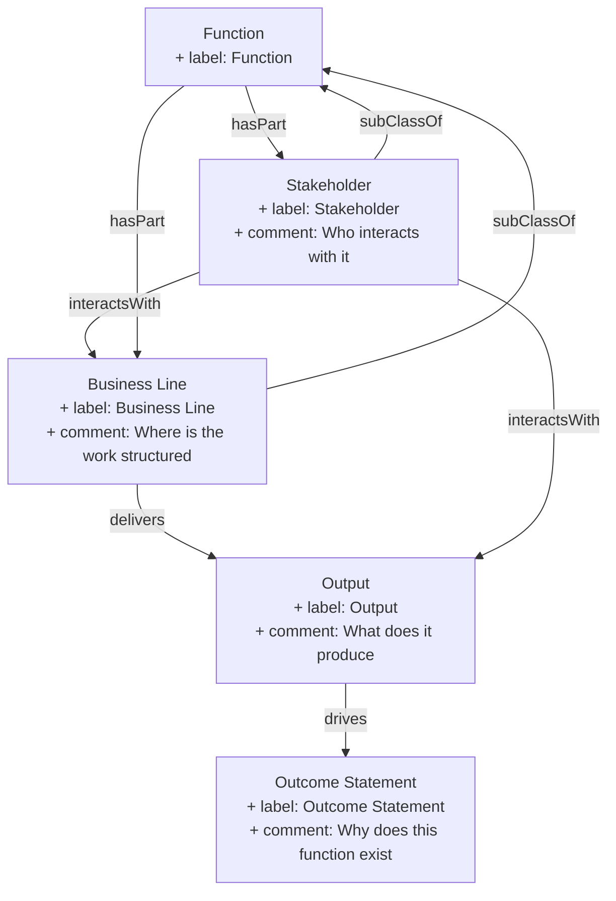

## Related Links

- [[business_line]]
- [[outcome_statement]]
- [[output]]
- [[stakeholder]]

## Semantic Connections

```mermaid
graph TD
  Function["Function<br>+ label: Function"]:::current-page-node
  Stakeholder["Stakeholder<br>+ label: Stakeholder<br>+ comment: Who interacts with it"]
  Business_Line["Business Line<br>+ label: Business Line<br>+ comment: Where is the work structured"]
  Output["Output<br>+ label: Output<br>+ comment: What does it produce"]
  Outcome_Statement["Outcome Statement<br>+ label: Outcome Statement<br>+ comment: Why does this function exist"]
  Stakeholder-->|" interactsWith "|Business_Line
  Business_Line-->|" delivers "|Output
  Function-->|" hasPart "|Business_Line
  Stakeholder-->|" subClassOf "|Function
  Function-->|" hasPart "|Stakeholder
  Stakeholder-->|" interactsWith "|Output
  Output-->|" drives "|Outcome_Statement
  Business_Line-->|" subClassOf "|Function
```
