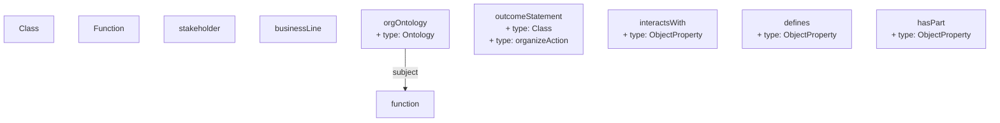

# Function
hasPart:
  - "[[businessLine]]"
  - "[[Stakeholder]]"

---

### Semantic Connections

```mermaid
graph TD
  function["function"]
  Class["Class"]
  Function["Function"]
  stakeholder["stakeholder"]
  businessLine["businessLine"]
  orgOntology["orgOntology<br>+ type: Ontology"]
  orgOntology-->|" subject "|function
  outcomeStatement["outcomeStatement<br>+ type: Class<br>+ type: organizeAction"]
  interactsWith["interactsWith<br>+ type: ObjectProperty"]
  defines["defines<br>+ type: ObjectProperty"]
  hasPart["hasPart<br>+ type: ObjectProperty"]
```