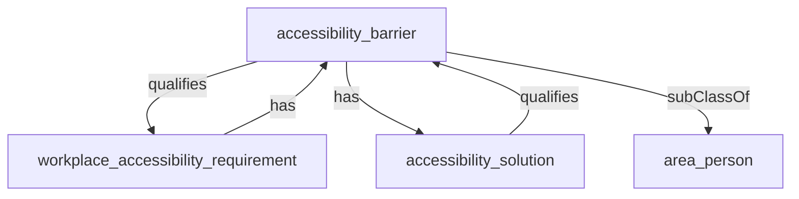

## Related Links

- [[accessibility_barrier]]
- [[accessibility_solution]]
- [[area_person]]
- [[workplace_accessibility_requirement]]

## Semantic Connections

```mermaid
graph TD
  accessibility_barrier["accessibility_barrier"]:::current-page-node
  area_person["area_person"]
  accessibility_solution["accessibility_solution"]
  workplace_accessibility_requirement["workplace_accessibility_requirement"]
  accessibility_barrier-->|" qualifies "|workplace_accessibility_requirement
  accessibility_barrier-->|" has "|accessibility_solution
  accessibility_solution-->|" qualifies "|accessibility_barrier
  workplace_accessibility_requirement-->|" has "|accessibility_barrier
  accessibility_barrier-->|" subClassOf "|area_person
```
