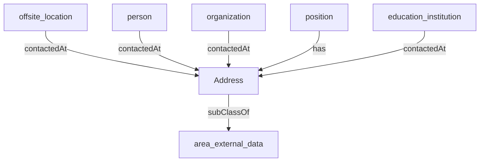

## Related Links

- [[address]]
- [[area_external_data]]
- [[education_institution]]
- [[offsite_location]]
- [[organization]]
- [[person]]
- [[position]]

## Semantic Connections

```mermaid
graph TD
  Address["Address"]:::current-page-node
  area_external_data["area_external_data"]
  education_institution["education_institution"]
  offsite_location["offsite_location"]
  organization["organization"]
  person["person"]
  position["position"]
  offsite_location-->|" contactedAt "|Address
  person-->|" contactedAt "|Address
  organization-->|" contactedAt "|Address
  Address-->|" subClassOf "|area_external_data
  position-->|" has "|Address
  education_institution-->|" contactedAt "|Address
```
