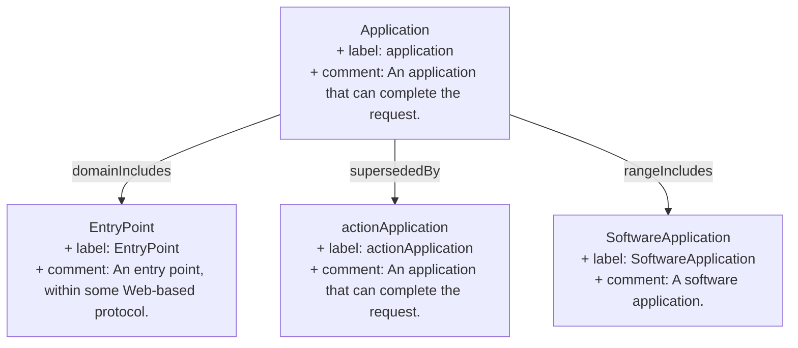

## Semantic Connections

```mermaid
graph TD
  Application["Application<br>+ label: application<br>+ comment: An application that can complete the request."]:::current-page-node
  EntryPoint["EntryPoint<br>+ label: EntryPoint<br>+ comment: An entry point, within some Web-based protocol."]
  SoftwareApplication["SoftwareApplication<br>+ label: SoftwareApplication<br>+ comment: A software application."]
  actionApplication["actionApplication<br>+ label: actionApplication<br>+ comment: An application that can complete the request."]
  Application-->|" domainIncludes "|EntryPoint
  Application-->|" supersededBy "|actionApplication
  Application-->|" rangeIncludes "|SoftwareApplication
```
