## Related Links

- [[bargaining_agent]]
- [[classification]]
- [[classification_decision]]
- [[classification_evaluation_authorization]]
- [[classification_standard]]
- [[classification_standard_factor]]
- [[collective_agreement]]
- [[factor]]
- [[hr_business_line_data]]
- [[occupational_group]]
- [[on_site_review]]
- [[relativity_review]]
- [[relativity_review_sample]]
- [[work_description]]
- [[work_description_status]]

## Semantic Connections

```mermaid
graph TD
  Classification["Classification"]:::current-page-node
  hr_business_line_data["hr_business_line_data"]
  occupational_category["occupational_category"]
  bargaining_agent["bargaining_agent"]
  classification_factor_point["classification_factor_point"]
  relativity_review_sample["relativity_review_sample"]
  tbs_terms_conditions["tbs_terms_conditions"]
  classification_standard_factor["classification_standard_factor"]
  factor["factor"]
  occupational_group["occupational_group"]
  on_site_review["on_site_review"]
  relativity_review["relativity_review"]
  work_description_status["work_description_status"]
  classification_decision["classification_decision"]
  classification_standard["classification_standard"]
  classification["classification"]
  classification_evaluation_authorization["classification_evaluation_authorization"]
  collective_agreement["collective_agreement"]
  work_description["work_description"]
  work_description_status-->|" subClassOf "|Classification
  classification-->|" subClassOf "|Classification
  Classification-->|" subClassOf "|hr_business_line_data
  classification_standard-->|" subClassOf "|Classification
  occupational_group-->|" subClassOf "|Classification
  work_description-->|" subClassOf "|Classification
  bargaining_agent-->|" subClassOf "|Classification
  classification_evaluation_authorization-->|" subClassOf "|Classification
  collective_agreement-->|" subClassOf "|Classification
  classification_factor_point-->|" subClassOf "|Classification
  occupational_category-->|" subClassOf "|Classification
  relativity_review_sample-->|" subClassOf "|Classification
  factor-->|" subClassOf "|Classification
  classification_decision-->|" subClassOf "|Classification
  tbs_terms_conditions-->|" subClassOf "|Classification
  relativity_review-->|" subClassOf "|Classification
  on_site_review-->|" subClassOf "|Classification
  classification_standard_factor-->|" subClassOf "|Classification
```

