## Related Links

- [[appointment]]
- [[area_compensation_leave_pension]]
- [[cash_receipt]]
- [[compensation]]
- [[deduction]]
- [[employee_benefit_election]]
- [[employee_benefit_election_status]]
- [[employee_request]]
- [[employer_request]]
- [[entitlement]]
- [[hours_of_work]]
- [[hours_recorded]]
- [[hr_business_line_data]]
- [[leave]]
- [[leave_balance]]
- [[pay_cheque]]
- [[pension]]
- [[pension_member_status]]
- [[record_of_employment]]
- [[reduced_salary_leave]]
- [[secondment]]
- [[separation]]
- [[work_schedule]]
- [[workplace_requirement]]
- [[workplace_requirement_status]]

## Semantic Connections

```mermaid
graph TD
  Compensation_Leave__Pension["Compensation, Leave & Pension"]:::current-page-node
  hr_business_line_data["hr_business_line_data"]
  cash_receipt["cash_receipt"]
  conditions_of_appointment["conditions_of_appointment"]
  schedule_submission_date["schedule_submission_date"]
  employee_benefit_election_status["employee_benefit_election_status"]
  pension_member_status["pension_member_status"]
  record_of_employment["record_of_employment"]
  workplace_requirement_status["workplace_requirement_status"]
  compensation["compensation"]
  leave_balance["leave_balance"]
  leave_type["leave_type"]
  reduced_salary_leave["reduced_salary_leave"]
  workplace_requirement["workplace_requirement"]
  hours_recorded["hours_recorded"]
  secondment["secondment"]
  employee_benefit_election["employee_benefit_election"]
  employer_request["employer_request"]
  pay_cheque["pay_cheque"]
  separation["separation"]
  pension["pension"]
  hours_of_work["hours_of_work"]
  employee_request["employee_request"]
  deduction["deduction"]
  leave["leave"]
  work_schedule["work_schedule"]
  entitlement["entitlement"]
  appointment["appointment"]
  entitlement-->|" subClassOf "|Compensation_Leave__Pension
  employer_request-->|" subClassOf "|Compensation_Leave__Pension
  reduced_salary_leave-->|" subClassOf "|Compensation_Leave__Pension
  leave-->|" subClassOf "|Compensation_Leave__Pension
  secondment-->|" subClassOf "|Compensation_Leave__Pension
  schedule_submission_date-->|" subClassOf "|Compensation_Leave__Pension
  leave_balance-->|" subClassOf "|Compensation_Leave__Pension
  deduction-->|" subClassOf "|Compensation_Leave__Pension
  workplace_requirement_status-->|" subClassOf "|Compensation_Leave__Pension
  hours_recorded-->|" subClassOf "|Compensation_Leave__Pension
  employee_request-->|" subClassOf "|Compensation_Leave__Pension
  compensation-->|" subClassOf "|Compensation_Leave__Pension
  Compensation_Leave__Pension-->|" subClassOf "|hr_business_line_data
  workplace_requirement-->|" subClassOf "|Compensation_Leave__Pension
  appointment-->|" subClassOf "|Compensation_Leave__Pension
  conditions_of_appointment-->|" subClassOf "|Compensation_Leave__Pension
  work_schedule-->|" subClassOf "|Compensation_Leave__Pension
  employee_benefit_election-->|" subClassOf "|Compensation_Leave__Pension
  separation-->|" subClassOf "|Compensation_Leave__Pension
  pension_member_status-->|" subClassOf "|Compensation_Leave__Pension
  cash_receipt-->|" subClassOf "|Compensation_Leave__Pension
  hours_of_work-->|" subClassOf "|Compensation_Leave__Pension
  employee_benefit_election_status-->|" subClassOf "|Compensation_Leave__Pension
  pay_cheque-->|" subClassOf "|Compensation_Leave__Pension
  leave_type-->|" subClassOf "|Compensation_Leave__Pension
  pension-->|" subClassOf "|Compensation_Leave__Pension
  record_of_employment-->|" subClassOf "|Compensation_Leave__Pension
```

