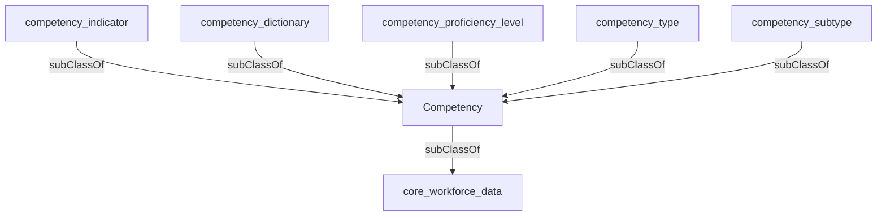

## Related Links

- [[area_competency]]
- [[competency_dictionary]]
- [[competency_indicator]]
- [[competency_proficiency_level]]
- [[competency_subtype]]
- [[competency_type]]
- [[core_workforce_data]]

## Semantic Connections

