## Related Links

- [[area_employee]]
- [[career_development]]
- [[core_workforce_data]]
- [[employee_classification]]
- [[employment_history]]
- [[financial_institution_information]]
- [[financial_institution_information_status]]
- [[medical_assessment]]
- [[offsite_location]]
- [[service_buy_back_election]]
- [[service_buy_back_election_status]]
- [[tax_information]]
- [[tax_information_status]]
- [[work_arrangement]]
- [[work_arrangement_schedule]]
- [[work_arrangement_status]]

## Semantic Connections

```mermaid
graph TD
  Employee["Employee"]:::current-page-node
  core_workforce_data["core_workforce_data"]
  financial_institution_information_status["financial_institution_information_status"]
  service_buy_back_election_status["service_buy_back_election_status"]
  tax_information_status["tax_information_status"]
  work_arrangement_status["work_arrangement_status"]
  career_development["career_development"]
  tax_information["tax_information"]
  work_arrangement_schedule["work_arrangement_schedule"]
  employee_classification["employee_classification"]
  employment_history["employment_history"]
  financial_institution_information["financial_institution_information"]
  offsite_location["offsite_location"]
  work_arrangement["work_arrangement"]
  medical_assessment["medical_assessment"]
  service_buy_back_election["service_buy_back_election"]
  work_arrangement_schedule-->|" subClassOf "|Employee
  employee_classification-->|" subClassOf "|Employee
  financial_institution_information-->|" subClassOf "|Employee
  work_arrangement_status-->|" subClassOf "|Employee
  Employee-->|" subClassOf "|core_workforce_data
  work_arrangement-->|" subClassOf "|Employee
  employment_history-->|" subClassOf "|Employee
  medical_assessment-->|" subClassOf "|Employee
  service_buy_back_election_status-->|" subClassOf "|Employee
  career_development-->|" subClassOf "|Employee
  offsite_location-->|" subClassOf "|Employee
  service_buy_back_election-->|" subClassOf "|Employee
  tax_information-->|" subClassOf "|Employee
  tax_information_status-->|" subClassOf "|Employee
  financial_institution_information_status-->|" subClassOf "|Employee
```

