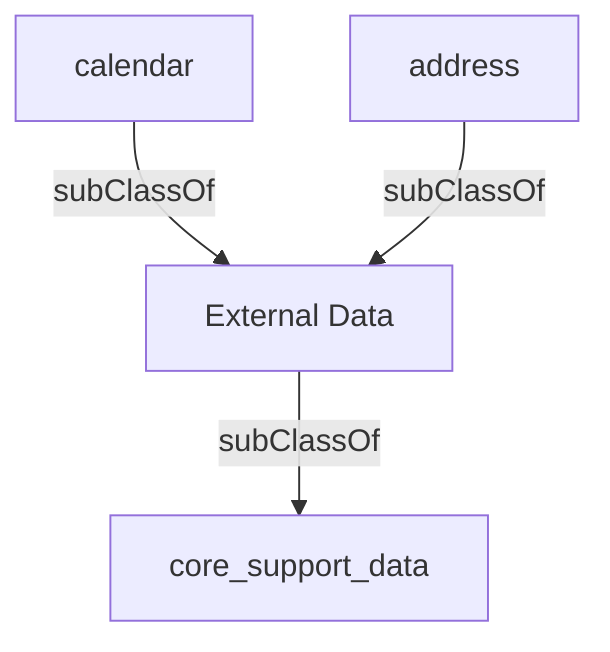

## Related Links

- [[address]]
- [[area_external_data]]
- [[calendar]]
- [[core_support_data]]

## Semantic Connections

```mermaid
graph TD
  External_Data["External Data"]:::current-page-node
  core_support_data["core_support_data"]
  calendar["calendar"]
  address["address"]
  calendar-->|" subClassOf "|External_Data
  External_Data-->|" subClassOf "|core_support_data
  address-->|" subClassOf "|External_Data
```
