## Related Links

- [[business_plan]]
- [[business_plan_status]]
- [[business_transformation_approach]]
- [[business_transformation_outcome]]
- [[data_analysis]]
- [[data_set]]
- [[hr_business_line_data]]
- [[labour_data]]
- [[measurement_collection]]
- [[measurement_framework]]
- [[report]]
- [[report_status]]
- [[reporting_requirement]]
- [[workforce_workplace_performance_measure]]
- [[workforce_workplace_planning]]

## Semantic Connections

```mermaid
graph TD
  HR_Planning__Reporting["HR Planning & Reporting"]:::current-page-node
  hr_business_line_data["hr_business_line_data"]
  business_plan_status["business_plan_status"]
  business_transformation_approach["business_transformation_approach"]
  report_status["report_status"]
  workforce_workplace_performance_measure["workforce_workplace_performance_measure"]
  labour_data["labour_data"]
  measurement_collection["measurement_collection"]
  data_analysis["data_analysis"]
  measurement_framework["measurement_framework"]
  reporting_requirement["reporting_requirement"]
  business_plan["business_plan"]
  business_transformation_outcome["business_transformation_outcome"]
  report["report"]
  workforce_workplace_planning["workforce_workplace_planning"]
  data_set["data_set"]
  business_plan_status-->|" subClassOf "|HR_Planning__Reporting
  measurement_collection-->|" subClassOf "|HR_Planning__Reporting
  data_set-->|" subClassOf "|HR_Planning__Reporting
  workforce_workplace_planning-->|" subClassOf "|HR_Planning__Reporting
  report-->|" subClassOf "|HR_Planning__Reporting
  business_plan-->|" subClassOf "|HR_Planning__Reporting
  measurement_framework-->|" subClassOf "|HR_Planning__Reporting
  reporting_requirement-->|" subClassOf "|HR_Planning__Reporting
  business_transformation_outcome-->|" subClassOf "|HR_Planning__Reporting
  HR_Planning__Reporting-->|" subClassOf "|hr_business_line_data
  workforce_workplace_performance_measure-->|" subClassOf "|HR_Planning__Reporting
  business_transformation_approach-->|" subClassOf "|HR_Planning__Reporting
  labour_data-->|" subClassOf "|HR_Planning__Reporting
  report_status-->|" subClassOf "|HR_Planning__Reporting
  data_analysis-->|" subClassOf "|HR_Planning__Reporting
```

