## Related Links

- [[area_learning_development]]
- [[developmental_opportunities_repository]]
- [[employee_learning_development_program]]
- [[employee_learning_evaluation]]
- [[employee_learning_event]]
- [[employee_learning_registration]]
- [[external_learning_event]]
- [[external_learning_session]]
- [[government_of_canada_travel]]
- [[hr_business_line_data]]
- [[learning_development_program]]
- [[learning_development_program_curriculum]]
- [[learning_event]]
- [[learning_event_plan]]
- [[learning_event_status]]
- [[learning_object]]
- [[learning_session]]
- [[learning_session_status]]

## Semantic Connections

```mermaid
graph TD
  Learning__Development["Learning & Development"]:::current-page-node
  hr_business_line_data["hr_business_line_data"]
  employee_learning_evaluation["employee_learning_evaluation"]
  employee_learning_development_program["employee_learning_development_program"]
  employee_learning_registration["employee_learning_registration"]
  learning_event_status["learning_event_status"]
  government_of_canada_travel["government_of_canada_travel"]
  learning_development_program["learning_development_program"]
  learning_event_plan["learning_event_plan"]
  learning_session_status["learning_session_status"]
  developmental_opportunities_repository["developmental_opportunities_repository"]
  learning_development_program_curriculum["learning_development_program_curriculum"]
  external_learning_session["external_learning_session"]
  learning_object["learning_object"]
  learning_session["learning_session"]
  external_learning_event["external_learning_event"]
  learning_event["learning_event"]
  employee_learning_event["employee_learning_event"]
  developmental_opportunities_repository-->|" subClassOf "|Learning__Development
  learning_development_program_curriculum-->|" subClassOf "|Learning__Development
  employee_learning_evaluation-->|" subClassOf "|Learning__Development
  learning_development_program-->|" subClassOf "|Learning__Development
  employee_learning_event-->|" subClassOf "|Learning__Development
  government_of_canada_travel-->|" subClassOf "|Learning__Development
  external_learning_event-->|" subClassOf "|Learning__Development
  learning_session-->|" subClassOf "|Learning__Development
  employee_learning_registration-->|" subClassOf "|Learning__Development
  learning_event-->|" subClassOf "|Learning__Development
  Learning__Development-->|" subClassOf "|hr_business_line_data
  learning_session_status-->|" subClassOf "|Learning__Development
  employee_learning_development_program-->|" subClassOf "|Learning__Development
  learning_event_status-->|" subClassOf "|Learning__Development
  learning_event_plan-->|" subClassOf "|Learning__Development
  learning_object-->|" subClassOf "|Learning__Development
  external_learning_session-->|" subClassOf "|Learning__Development
```

