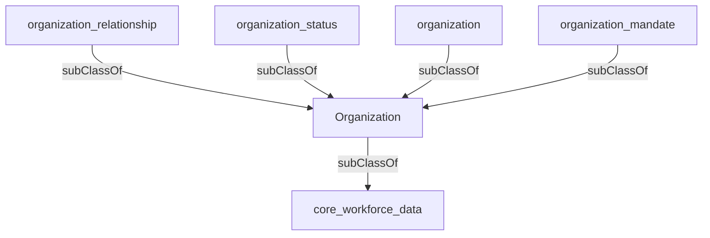

## Related Links

- [[core_workforce_data]]
- [[organization]]
- [[organization_relationship]]
- [[organization_status]]

## Semantic Connections

```mermaid
graph TD
  Organization["Organization"]:::current-page-node
  core_workforce_data["core_workforce_data"]
  organization_status["organization_status"]
  organization_mandate["organization_mandate"]
  organization["organization"]
  organization_relationship["organization_relationship"]
  organization_relationship-->|" subClassOf "|Organization
  organization_status-->|" subClassOf "|Organization
  organization-->|" subClassOf "|Organization
  organization_mandate-->|" subClassOf "|Organization
  Organization-->|" subClassOf "|core_workforce_data
```
