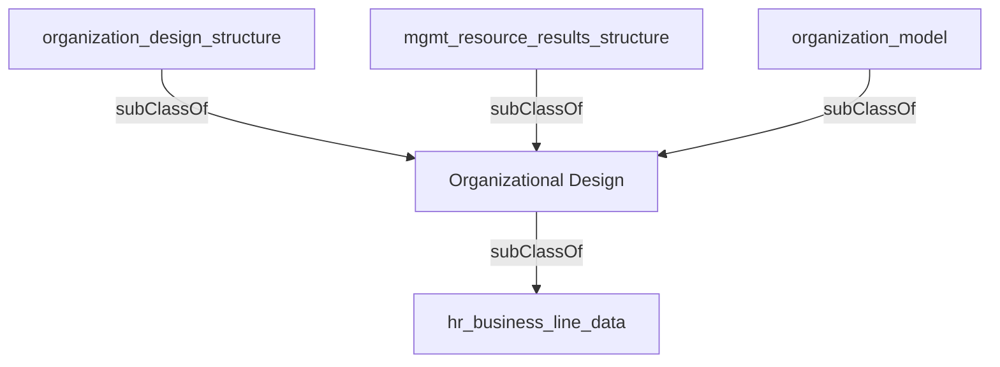

## Related Links

- [[area_organizational_design]]
- [[hr_business_line_data]]
- [[mgmt_resource_results_structure]]
- [[organization_design_structure]]
- [[organization_model]]

## Semantic Connections

