## Related Links

- [[accessibility_barrier]]
- [[accessibility_solution]]
- [[core_workforce_data]]
- [[education_institution]]
- [[employment_equity_designated_group_membership]]
- [[external_employment_history]]
- [[language_evaluation]]
- [[marital_status]]
- [[membership]]
- [[person]]
- [[person_competency]]
- [[person_contact]]
- [[person_contact_status]]
- [[person_education]]
- [[person_email]]
- [[person_license_certification]]
- [[person_name]]
- [[person_preference]]
- [[preference]]
- [[security_clearance]]
- [[self_identification_group_membership]]
- [[telephone]]
- [[workplace_accessibility_requirement]]

## Semantic Connections

```mermaid
graph TD
  Person["Person"]:::current-page-node
  core_workforce_data["core_workforce_data"]
  person_contact_status["person_contact_status"]
  person_preference["person_preference"]
  accessibility_solution["accessibility_solution"]
  education_institution["education_institution"]
  marital_status["marital_status"]
  preference["preference"]
  person_contact["person_contact"]
  person_education["person_education"]
  accessibility_barrier["accessibility_barrier"]
  external_employment_history["external_employment_history"]
  person_competency["person_competency"]
  person_email["person_email"]
  security_clearance["security_clearance"]
  membership["membership"]
  employment_equity_designated_group_membership["employment_equity_designated_group_membership"]
  telephone["telephone"]
  language_evaluation["language_evaluation"]
  self_identification_group_membership["self_identification_group_membership"]
  person_license_certification["person_license_certification"]
  workplace_accessibility_requirement["workplace_accessibility_requirement"]
  person["person"]
  person_name["person_name"]
  person_license_certification-->|" subClassOf "|Person
  external_employment_history-->|" subClassOf "|Person
  education_institution-->|" subClassOf "|Person
  membership-->|" subClassOf "|Person
  Person-->|" subClassOf "|core_workforce_data
  person_contact_status-->|" subClassOf "|Person
  person_competency-->|" subClassOf "|Person
  person_education-->|" subClassOf "|Person
  employment_equity_designated_group_membership-->|" subClassOf "|Person
  person_preference-->|" subClassOf "|Person
  telephone-->|" subClassOf "|Person
  language_evaluation-->|" subClassOf "|Person
  person_contact-->|" subClassOf "|Person
  preference-->|" subClassOf "|Person
  self_identification_group_membership-->|" subClassOf "|Person
  person_email-->|" subClassOf "|Person
  security_clearance-->|" subClassOf "|Person
  person-->|" subClassOf "|Person
  marital_status-->|" subClassOf "|Person
  accessibility_barrier-->|" subClassOf "|Person
  accessibility_solution-->|" subClassOf "|Person
  person_name-->|" subClassOf "|Person
  workplace_accessibility_requirement-->|" subClassOf "|Person
```

