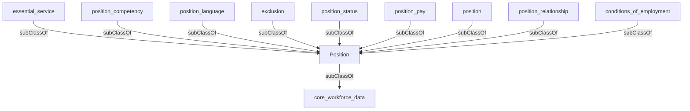

## Related Links

- [[conditions_of_employment]]
- [[core_workforce_data]]
- [[essential_service]]
- [[exclusion]]
- [[position]]
- [[position_competency]]
- [[position_language]]
- [[position_pay]]
- [[position_relationship]]
- [[position_status]]

## Semantic Connections

