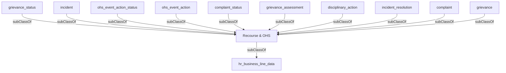

## Related Links

- [[area_recourse_ohs]]
- [[complaint]]
- [[complaint_status]]
- [[disciplinary_action]]
- [[grievance]]
- [[grievance_assessment]]
- [[grievance_status]]
- [[hr_business_line_data]]
- [[incident]]
- [[incident_resolution]]
- [[ohs_event_action]]
- [[ohs_event_action_status]]

## Semantic Connections

