## Related Links

- [[advertising_campaign]]
- [[applicant_evaluation]]
- [[application]]
- [[application_status]]
- [[area_staffing]]
- [[assessment_activity]]
- [[assessment_board_member]]
- [[assessment_tool]]
- [[assessment_tool_repository]]
- [[collective_staffing_team_member]]
- [[development_program_repository]]
- [[externally_administered_assessment]]
- [[government_of_canada_assessment_board]]
- [[hr_business_line_data]]
- [[informal_discussion]]
- [[person_pool_status]]
- [[pool]]
- [[priority_candidate_repository]]
- [[qualification_evaluation]]
- [[qualification_repository]]
- [[reference]]
- [[staffing_process]]
- [[staffing_process_area_of_selection]]
- [[staffing_process_qualification]]
- [[staffing_process_status]]
- [[student_program_repository]]

## Semantic Connections

```mermaid
graph TD
  Staffing["Staffing"]:::current-page-node
  hr_business_line_data["hr_business_line_data"]
  development_program_repository["development_program_repository"]
  government_of_canada_assessment_board["government_of_canada_assessment_board"]
  student_program_repository["student_program_repository"]
  assessment_board_member["assessment_board_member"]
  collective_staffing_team_member["collective_staffing_team_member"]
  person_pool_status["person_pool_status"]
  staffing_process_area_of_selection["staffing_process_area_of_selection"]
  staffing_process_qualification["staffing_process_qualification"]
  staffing_process_status["staffing_process_status"]
  application["application"]
  application_status["application_status"]
  informal_discussion["informal_discussion"]
  qualification_evaluation["qualification_evaluation"]
  qualification_repository["qualification_repository"]
  assessment_tool_repository["assessment_tool_repository"]
  staffing_process_type["staffing_process_type"]
  advertising_campaign["advertising_campaign"]
  assessment_tool["assessment_tool"]
  externally_administered_assessment["externally_administered_assessment"]
  pool["pool"]
  reference["reference"]
  staffing_process["staffing_process"]
  applicant_evaluation["applicant_evaluation"]
  assessment_activity["assessment_activity"]
  priority_candidate_repository["priority_candidate_repository"]
  assessment_tool-->|" subClassOf "|Staffing
  reference-->|" subClassOf "|Staffing
  development_program_repository-->|" subClassOf "|Staffing
  externally_administered_assessment-->|" subClassOf "|Staffing
  qualification_repository-->|" subClassOf "|Staffing
  advertising_campaign-->|" subClassOf "|Staffing
  Staffing-->|" subClassOf "|hr_business_line_data
  government_of_canada_assessment_board-->|" subClassOf "|Staffing
  application-->|" subClassOf "|Staffing
  pool-->|" subClassOf "|Staffing
  staffing_process_qualification-->|" subClassOf "|Staffing
  person_pool_status-->|" subClassOf "|Staffing
  staffing_process_type-->|" subClassOf "|Staffing
  assessment_tool_repository-->|" subClassOf "|Staffing
  application_status-->|" subClassOf "|Staffing
  staffing_process_status-->|" subClassOf "|Staffing
  collective_staffing_team_member-->|" subClassOf "|Staffing
  applicant_evaluation-->|" subClassOf "|Staffing
  informal_discussion-->|" subClassOf "|Staffing
  priority_candidate_repository-->|" subClassOf "|Staffing
  staffing_process_area_of_selection-->|" subClassOf "|Staffing
  student_program_repository-->|" subClassOf "|Staffing
  staffing_process-->|" subClassOf "|Staffing
  assessment_activity-->|" subClassOf "|Staffing
  qualification_evaluation-->|" subClassOf "|Staffing
  assessment_board_member-->|" subClassOf "|Staffing
```

