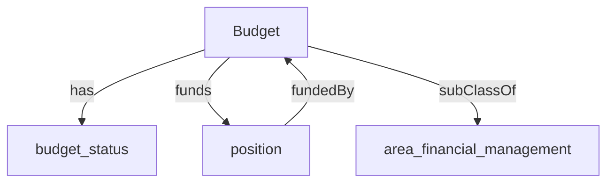

## Related Links

- [[area_financial_management]]
- [[budget_status]]
- [[position]]

## Semantic Connections

```mermaid
graph TD
  Budget["Budget"]:::current-page-node
  area_financial_management["area_financial_management"]
  position["position"]
  budget_status["budget_status"]
  Budget-->|" has "|budget_status
  position-->|" fundedBy "|Budget
  Budget-->|" funds "|position
  Budget-->|" subClassOf "|area_financial_management
```
