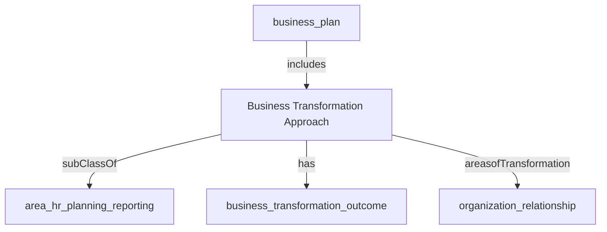

## Related Links

- [[area_hr_planning_reporting]]
- [[business_plan]]
- [[business_transformation_approach]]
- [[business_transformation_outcome]]
- [[organization_relationship]]

## Semantic Connections

