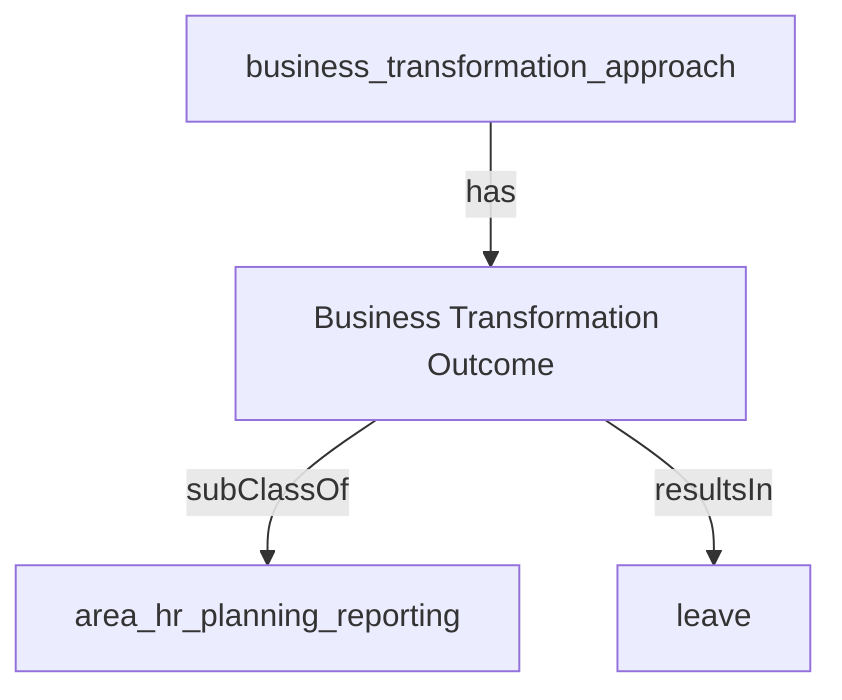

## Related Links

- [[area_hr_planning_reporting]]
- [[business_transformation_approach]]
- [[business_transformation_outcome]]
- [[leave]]

## Semantic Connections

```mermaid
graph TD
  Business_Transformation_Outcome["Business Transformation Outcome"]:::current-page-node
  area_hr_planning_reporting["area_hr_planning_reporting"]
  leave["leave"]
  business_transformation_approach["business_transformation_approach"]
  Business_Transformation_Outcome-->|" subClassOf "|area_hr_planning_reporting
  Business_Transformation_Outcome-->|" resultsIn "|leave
  business_transformation_approach-->|" has "|Business_Transformation_Outcome
```
