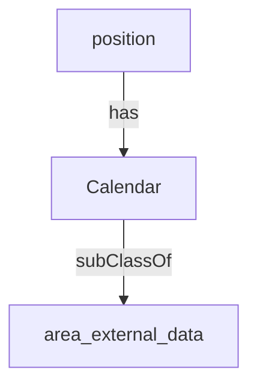

## Related Links

- [[area_external_data]]
- [[position]]

## Semantic Connections

```mermaid
graph TD
  Calendar["Calendar"]:::current-page-node
  area_external_data["area_external_data"]
  position["position"]
  Calendar-->|" subClassOf "|area_external_data
  position-->|" has "|Calendar
```
