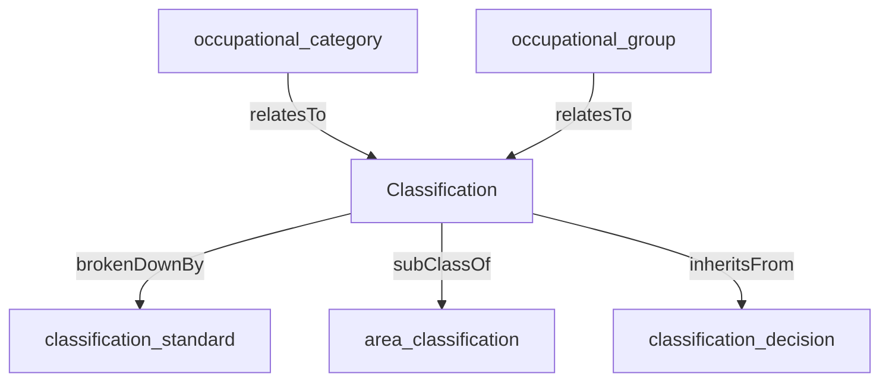

## Related Links

- [[area_classification]]
- [[classification]]
- [[classification_decision]]
- [[classification_standard]]
- [[occupational_group]]

## Semantic Connections

```mermaid
graph TD
  Classification["Classification"]:::current-page-node
  area_classification["area_classification"]
  classification_standard["classification_standard"]
  classification_decision["classification_decision"]
  occupational_category["occupational_category"]
  occupational_group["occupational_group"]
  occupational_category-->|" relatesTo "|Classification
  Classification-->|" brokenDownBy "|classification_standard
  Classification-->|" subClassOf "|area_classification
  Classification-->|" inheritsFrom "|classification_decision
  occupational_group-->|" relatesTo "|Classification
```
