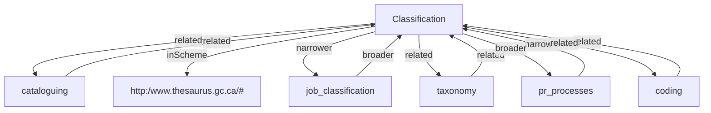

## Semantic Connections

```mermaid
graph TD
  Classification["Classification"]:::current-page-node
  pr_processes["pr_processes"]
  httpwwwthesaurusgcca["http:/www.thesaurus.gc.ca/#"]
  job_classification["job_classification"]
  cataloguing["cataloguing"]
  coding["coding"]
  taxonomy["taxonomy"]
  Classification-->|" related "|cataloguing
  Classification-->|" inScheme "|httpwwwthesaurusgcca
  pr_processes-->|" narrower "|Classification
  cataloguing-->|" related "|Classification
  taxonomy-->|" related "|Classification
  Classification-->|" narrower "|job_classification
  coding-->|" related "|Classification
  Classification-->|" related "|taxonomy
  job_classification-->|" broader "|Classification
  Classification-->|" broader "|pr_processes
  Classification-->|" related "|coding
```
