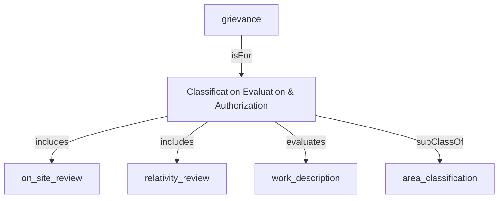

## Related Links

- [[area_classification]]
- [[grievance]]
- [[on_site_review]]
- [[relativity_review]]
- [[work_description]]

## Semantic Connections

```mermaid
graph TD
  Classification_Evaluation__Authorization["Classification Evaluation & Authorization"]:::current-page-node
  area_classification["area_classification"]
  work_description["work_description"]
  on_site_review["on_site_review"]
  relativity_review["relativity_review"]
  grievance["grievance"]
  Classification_Evaluation__Authorization-->|" includes "|on_site_review
  Classification_Evaluation__Authorization-->|" includes "|relativity_review
  Classification_Evaluation__Authorization-->|" evaluates "|work_description
  grievance-->|" isFor "|Classification_Evaluation__Authorization
  Classification_Evaluation__Authorization-->|" subClassOf "|area_classification
```
