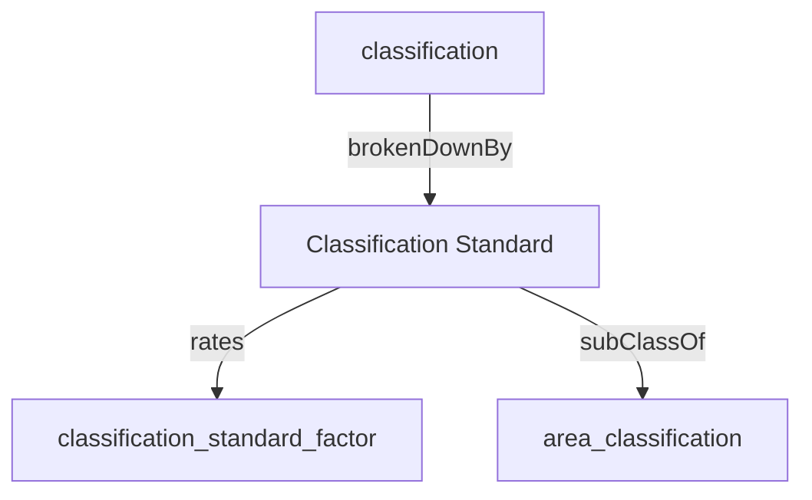

## Related Links

- [[area_classification]]
- [[classification]]
- [[classification_standard]]
- [[classification_standard_factor]]

## Semantic Connections

```mermaid
graph TD
  Classification_Standard["Classification Standard"]:::current-page-node
  area_classification["area_classification"]
  classification_standard_factor["classification_standard_factor"]
  classification["classification"]
  Classification_Standard-->|" rates "|classification_standard_factor
  classification-->|" brokenDownBy "|Classification_Standard
  Classification_Standard-->|" subClassOf "|area_classification
```
