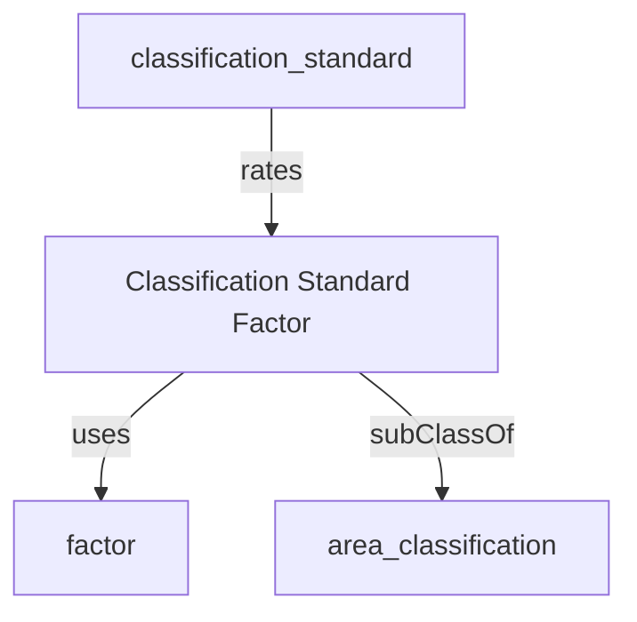

## Related Links

- [[area_classification]]
- [[classification_standard]]
- [[classification_standard_factor]]
- [[factor]]

## Semantic Connections

```mermaid
graph TD
  Classification_Standard_Factor["Classification Standard Factor"]:::current-page-node
  area_classification["area_classification"]
  factor["factor"]
  classification_standard["classification_standard"]
  Classification_Standard_Factor-->|" uses "|factor
  classification_standard-->|" rates "|Classification_Standard_Factor
  Classification_Standard_Factor-->|" subClassOf "|area_classification
```
