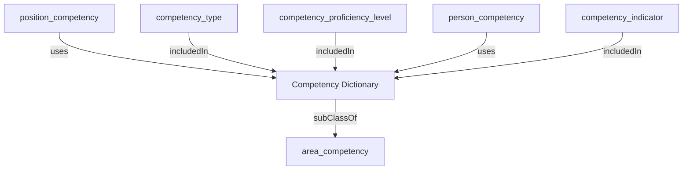

## Related Links

- [[area_competency]]
- [[competency_indicator]]
- [[competency_proficiency_level]]
- [[competency_type]]
- [[person_competency]]
- [[position_competency]]

## Semantic Connections

